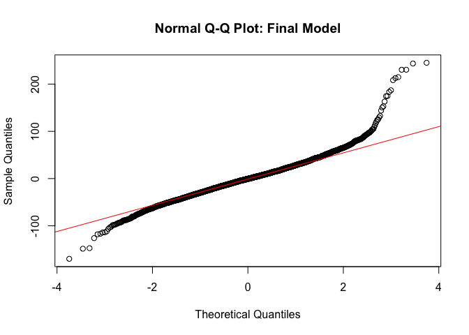

A Simple Time Series Model for Daily Crime Rate
================
Jen Boyce

``` r
library(zoo)
library(fBasics)
library(fUnitRoots)
library(forecast)
library(lmtest)
library(tseries)
library(rmarkdown)

options("scipen"=100)
options(digits=3)
```

Load the data
-------------

#### We'll need to count up the number of crimes per day, and convert the data into a time series object using the zoo package.

``` r
crimes = read.csv('violent_only_simple.csv')
c_ts <- as.Date(crimes$Date, format='%m/%d/%Y')
counts <- as.data.frame(table(c_ts))
t <- ts(counts$Freq, start=c(2001,1), freq=1)  # Make a table with the daily counts
ts_c <- zoo(counts$Freq, as.Date(as.character(counts$c_ts), format='%Y-%m-%d'))  # Convert counts to a time series object
```

Explore the data
----------------

``` r
plot(ts_c, ylab='Number of Crimes Per Day', xlab='Date', main='Number of Violent Crimes per Day in Chicago')
```


<br>

#### Overall, crime is headed down (despite what the news implies). Notice the repeating pattern that suggests a seasonality model.

<br>

``` r
hist(ts_c, xlab="Number of Crimes", freq=F, ylim=c(0,0.006), main='Distribution of Number of Crimes')
xfit<-seq(min(ts_c),max(ts_c),length=40)
yfit<-dnorm(xfit,mean=mean(ts_c),sd=sd(ts_c))
lines(xfit, yfit, col="black", lwd=2)
```


``` r
boxplot(counts$Freq, main='Daily Number of Crimes')
```


``` r
qqnorm(ts_c)
qqline(ts_c, col=2)
```


``` r
basicStats(as.integer(counts$Freq))
```

    ##             as.integer.counts.Freq
    ## nobs                      5517.000
    ## NAs                          0.000
    ## Minimum                     80.000
    ## Maximum                    547.000
    ## 1. Quartile                210.000
    ## 3. Quartile                322.000
    ## Mean                       269.624
    ## Median                     264.000
    ## Sum                    1487516.000
    ## SE Mean                      1.016
    ## LCL Mean                   267.632
    ## UCL Mean                   271.616
    ## Variance                  5696.023
    ## Stdev                       75.472
    ## Skewness                     0.357
    ## Kurtosis                    -0.380

<br>

#### Daily crime rate has a relatively normal distribution, although there is deviation from normality in the tails. There are a few outliers, but they aren't severe enough to cause problems.

<br> <br>

Is a time series model appropriate?
-----------------------------------

### Check for serial correlation

### ACF analysis

``` r
acf(coredata(ts_c, plot=T, lag=50), main='ACF of Crime Counts')
```


``` r
pacf(ts_c, lag=50, main='PACF of Crime Counts')
```


<br>

#### Values exceed the significance threshold, so autocorrelation is present. There's a strong repeating pattern, which indicates that a seasonal model should be considered. Peaks occur at mulitples of 7, so it's most likely that the seasonality is weekly.

#### We also see values that decay very slowly toward zero, indicating that the process is non-stationary. (Mean is not consistent over the entire time period.)

<br>

### Box Ljung Test

``` r
Box.test(ts_c,lag=3, type='Ljung')
```

    ## 
    ##  Box-Ljung test
    ## 
    ## data:  ts_c
    ## X-squared = 10000, df = 3, p-value <0.0000000000000002

``` r
Box.test(ts_c,lag=5,fitdf=2, type='Ljung')
```

    ## 
    ##  Box-Ljung test
    ## 
    ## data:  ts_c
    ## X-squared = 20000, df = 3, p-value <0.0000000000000002

``` r
Box.test(ts_c,lag=7,fitdf=5, type='Ljung')
```

    ## 
    ##  Box-Ljung test
    ## 
    ## data:  ts_c
    ## X-squared = 20000, df = 2, p-value <0.0000000000000002

<br>

#### The p-values are tiny, indicating that autocorrelation is present.

<br>

### Differencing

<br>

#### The ACF plot shows that the process is not stationary, so apply first differencing to account for the changing mean.

``` r
dx <- diff(ts_c)
acf(as.vector(dx), lag.max = 26, main='ACF of First Difference')
```


 \#\#\#\# We can further confirm that differencing was needed with the Dickey-Fuller test.

<br>

``` r
adfTest(t, lags=1, type=c("nc"))
```

    ## Warning in adfTest(t, lags = 1, type = c("nc")): p-value smaller than
    ## printed p-value

    ## 
    ## Title:
    ##  Augmented Dickey-Fuller Test
    ## 
    ## Test Results:
    ##   PARAMETER:
    ##     Lag Order: 1
    ##   STATISTIC:
    ##     Dickey-Fuller: -4.2465
    ##   P VALUE:
    ##     0.01 
    ## 
    ## Description:
    ##  Mon Apr 11 12:52:22 2016 by user:

``` r
adfTest(t, lags=3, type=c("nc"))
```

    ## Warning in adfTest(t, lags = 3, type = c("nc")): p-value smaller than
    ## printed p-value

    ## 
    ## Title:
    ##  Augmented Dickey-Fuller Test
    ## 
    ## Test Results:
    ##   PARAMETER:
    ##     Lag Order: 3
    ##   STATISTIC:
    ##     Dickey-Fuller: -2.7588
    ##   P VALUE:
    ##     0.01 
    ## 
    ## Description:
    ##  Mon Apr 11 12:52:22 2016 by user:

``` r
adfTest(t, lags=6, type=c("nc"))
```

    ## 
    ## Title:
    ##  Augmented Dickey-Fuller Test
    ## 
    ## Test Results:
    ##   PARAMETER:
    ##     Lag Order: 6
    ##   STATISTIC:
    ##     Dickey-Fuller: -1.4466
    ##   P VALUE:
    ##     0.1553 
    ## 
    ## Description:
    ##  Mon Apr 11 12:52:22 2016 by user:

<br>

#### The Dickey-Fuller test only indicates unit root non-stationarity at lag 1. It's not an especially strong result, but still means that a non-stationary model should be considered.

#### After first differening, we still see a repeating pattern on the ACF plot, so a second differencing is needed to account for seasonality.

<br>

``` r
sx <- diff(dx,7)
acf(as.vector(sx), lag.max = 25, main='ACF of Weekly Difference')
```


``` r
pacf(sx, lag=50, main='PACF of Weekly Difference')
```


``` r
plot(sx)
```


 \#\#\#\# We've addressed seasonality and stationarity, and the ACF plot is no longer showing indicators of non-stationarity or seasonality. The system is ready to model.

<br>

Model the data
--------------

### Try auto model selection

``` r
m1 <- auto.arima(ts_c, trace=T, max.p=20, max.q=20,max.order=100, seasonal = TRUE, ic='bic',stationary = FALSE)
```

    ## 
    ##  ARIMA(2,1,2) with drift         : 55069
    ##  ARIMA(0,1,0) with drift         : 56864
    ##  ARIMA(1,1,0) with drift         : 56429
    ##  ARIMA(0,1,1) with drift         : 55691
    ##  ARIMA(0,1,0)                    : 56856
    ##  ARIMA(1,1,2) with drift         : 55101
    ##  ARIMA(3,1,2) with drift         : 55063
    ##  ARIMA(3,1,1) with drift         : 55064
    ##  ARIMA(3,1,3) with drift         : 55067
    ##  ARIMA(2,1,1) with drift         : 55068
    ##  ARIMA(4,1,3) with drift         : 55061
    ##  ARIMA(4,1,3)                    : 55053
    ##  ARIMA(3,1,3)                    : 55058
    ##  ARIMA(5,1,3)                    : Inf
    ##  ARIMA(4,1,2)                    : 55036
    ##  ARIMA(3,1,1)                    : 55056
    ##  ARIMA(4,1,2) with drift         : 55045
    ##  ARIMA(3,1,2)                    : 55055
    ##  ARIMA(5,1,2)                    : 55029
    ##  ARIMA(5,1,1)                    : 55026
    ##  ARIMA(4,1,0)                    : 55703
    ##  ARIMA(6,1,2)                    : 54980
    ##  ARIMA(6,1,2) with drift         : 54988
    ##  ARIMA(7,1,2)                    : 54847
    ##  ARIMA(7,1,1)                    : 54979
    ##  ARIMA(7,1,3)                    : Inf
    ##  ARIMA(6,1,1)                    : 54973
    ##  ARIMA(8,1,3)                    : Inf
    ##  ARIMA(7,1,2) with drift         : 54856
    ##  ARIMA(8,1,2)                    : 54808
    ##  ARIMA(8,1,1)                    : 54819
    ##  ARIMA(9,1,3)                    : Inf
    ##  ARIMA(8,1,2) with drift         : 54816
    ##  ARIMA(9,1,2)                    : 54781
    ##  ARIMA(9,1,1)                    : 54805
    ##  ARIMA(10,1,3)                    : 54802
    ##  ARIMA(9,1,2) with drift         : 54790
    ##  ARIMA(10,1,2)                    : 54791
    ## 
    ##  Best model: ARIMA(9,1,2)

<br>

#### The best model selected is an ARIMA(9,1,2), with BIC value 54810. Interestingly, this model does not include seasonality or unit root nonstationarity.

#### Check and make sure all of the model coefficients are significant. Here, there are some non-significant ones that could be removed.

<br>

``` r
coeftest(m1)
```

    ## 
    ## z test of coefficients:
    ## 
    ##     Estimate Std. Error z value             Pr(>|z|)    
    ## ar1   0.9268     0.0742   12.49 < 0.0000000000000002 ***
    ## ar2  -0.2632     0.0321   -8.20  0.00000000000000024 ***
    ## ar3  -0.0105     0.0192   -0.55               0.5852    
    ## ar4  -0.0382     0.0190   -2.01               0.0443 *  
    ## ar5  -0.0424     0.0190   -2.23               0.0260 *  
    ## ar6   0.0572     0.0191    2.99               0.0028 ** 
    ## ar7   0.1532     0.0189    8.12  0.00000000000000047 ***
    ## ar8  -0.1893     0.0241   -7.87  0.00000000000000353 ***
    ## ar9  -0.0302     0.0187   -1.61               0.1070    
    ## ma1  -1.4980     0.0732  -20.46 < 0.0000000000000002 ***
    ## ma2   0.5571     0.0663    8.41 < 0.0000000000000002 ***
    ## ---
    ## Signif. codes:  0 '***' 0.001 '**' 0.01 '*' 0.05 '.' 0.1 ' ' 1

Check the residuals
-------------------

``` r
acf(coredata(m1$residuals, plot=T, lag=20), main='ACF of Auto.Arima Model')
```


``` r
pacf(coredata(m1$residuals, lag=20), main='PACF of Auto.Arima Model')
```


 \#\#\#\# Both the ACF and PACF plots show repeating patterns that indicate seasonality is not captured by our model.

#### If our model accurately describes the patterns in the data, residuals should be random and normally distributed. Try the Box Ljung test to check randomness of residuals.

``` r
Box.test(m1$residuals,lag=3,fitdf=5, type='Ljung')
```

    ## Warning in pchisq(STATISTIC, lag - fitdf): NaNs produced

    ## 
    ##  Box-Ljung test
    ## 
    ## data:  m1$residuals
    ## X-squared = 0.2, df = -2, p-value = NA

``` r
Box.test(m1$residuals,lag=6,fitdf=5, type='Ljung')
```

    ## 
    ##  Box-Ljung test
    ## 
    ## data:  m1$residuals
    ## X-squared = 4, df = 1, p-value = 0.04

``` r
Box.test(m1$residuals,lag=10,fitdf=5, type='Ljung')
```

    ## 
    ##  Box-Ljung test
    ## 
    ## data:  m1$residuals
    ## X-squared = 30, df = 5, p-value = 0.00003

<br>

#### P-values are significant at the 0.95 level, meaning that residuals are not random. There are patterns present that our model doesn't describe.

<br>

### Plot residuals

``` r
qqnorm(m1$residuals)
qqline(m1$residuals, col=2)
```


 \#\#\#\# There is considerable deviation from normality in the tails.

Forecast with the model
-----------------------

#### Although residual analysis shows it's not a very good model, let's use it to do a basic forecast and see what happens.

``` r
f1 <- forecast(m1, h=10)
plot(f1, include=100)
```


 <br>

#### We can see that the forecast captures some of the movement in values, but the predictions don't look very much like what we've seen in the past. The forecast supports the conclusions from residual analysis- this is not a very good model.

<br>

Try alternative models
----------------------

#### We need to re-work the model and see if we can do better. I'm going to omit the other trials for the sake of brevity, and just show the best model. I'm defining "best" as the model with the lowest BIC value that also passes residual analysis evaluation.

<br>

Final Model
-----------

#### After trying a number of different options, this is the final model, with a BIC value of 54140.

``` r
final <- Arima(ts_c, order=c(8,1,1), seasonal=list(order=c(0,1,2), period=7),  method='ML') 
final$bic
```

    ## [1] 54140

### Check significance of model coefficients

``` r
coeftest(final)
```

    ## 
    ## z test of coefficients:
    ## 
    ##      Estimate Std. Error z value             Pr(>|z|)    
    ## ar1   0.37664    0.01613   23.35 < 0.0000000000000002 ***
    ## ar2  -0.01301    0.00893   -1.46                 0.15    
    ## ar3   0.00443    0.00871    0.51                 0.61    
    ## ar4  -0.00453    0.00877   -0.52                 0.61    
    ## ar5  -0.00358    0.00866   -0.41                 0.68    
    ## ar6   0.05315    0.00903    5.89         0.0000000039 ***
    ## ar7   0.81512    0.01811   45.02 < 0.0000000000000002 ***
    ## ar8  -0.29851    0.01511  -19.75 < 0.0000000000000002 ***
    ## ma1  -0.94274    0.00857 -109.98 < 0.0000000000000002 ***
    ## sma1 -1.74781    0.02179  -80.21 < 0.0000000000000002 ***
    ## sma2  0.74781    0.02174   34.39 < 0.0000000000000002 ***
    ## ---
    ## Signif. codes:  0 '***' 0.001 '**' 0.01 '*' 0.05 '.' 0.1 ' ' 1

#### There are a few that are nonsignificant, and could be removed. <br>

### Plot ACF and PACF

``` r
acf(coredata(final$residuals, plot=T, lag=15), main='ACF of Final Model')
```


``` r
pacf(coredata(final$residuals, lag=20), main='PACF of Final Model')
```


 \#\#\#\# ACF and PACF look good. We no longer see repeating patterns, and the ACF plot only shows one lag above the dotted line. Since there's only one value, and it's at a high lag, it likely represents a shock to the system. Overall, though, the plots indicate that residuals are not correlated (which is a good thing.)

### Box Ljung Test

``` r
Box.test(final$residuals,lag=3,fitdf=1, type='Ljung')
```

    ## 
    ##  Box-Ljung test
    ## 
    ## data:  final$residuals
    ## X-squared = 5, df = 2, p-value = 0.09

``` r
Box.test(final$residuals,lag=6,fitdf=1, type='Ljung')
```

    ## 
    ##  Box-Ljung test
    ## 
    ## data:  final$residuals
    ## X-squared = 8, df = 5, p-value = 0.1

``` r
Box.test(final$residuals,lag=10,fitdf=1, type='Ljung')
```

    ## 
    ##  Box-Ljung test
    ## 
    ## data:  final$residuals
    ## X-squared = 10, df = 9, p-value = 0.1

#### Box Ljung tests show that residuals are white noise.

Check Normality
---------------

``` r
qqnorm(final$residuals, main='Normal Q-Q Plot: Final Model')
qqline(final$residuals, col=2)
```



#### The distribution of residuals shows quite a bit of deviation from normality in the tails. It's problematic, and shows that our model isn't ideal. Given the acceptable ACF/PACF and Box Ljung, though, the model is probably usable.

Forecast with the model
-----------------------

``` r
forecast_final <- forecast(final, h=10)
forecast_final
```

    ##       Point Forecast Lo 80 Hi 80 Lo 95 Hi 95
    ## 16840            143 101.6   185  79.5   207
    ## 16841            152 107.0   198  82.9   222
    ## 16842            157 110.3   203  85.8   227
    ## 16843            164 117.0   210  92.3   235
    ## 16844            176 129.2   223 104.4   248
    ## 16845            183 135.8   230 111.0   255
    ## 16846            147  99.2   194  74.2   219
    ## 16847            147  99.2   195  73.7   221
    ## 16848            154 105.1   202  79.5   228
    ## 16849            156 107.5   205  81.7   231

``` r
plot(forecast_final, include=100)
```


#### This forecast matches the previous behavior of the system much better than our first model. Values in our forecast are a little slower to change than what we've observed in the past. Overall, though, it puts us in the ballpark.

Conclusion
----------

#### The final model is definitely not perfect, and has a lot of room for improvement. Despite its flaws, it has some merit, and could be used for applications where it's sufficient to predict general trends, rather than specfic values.
